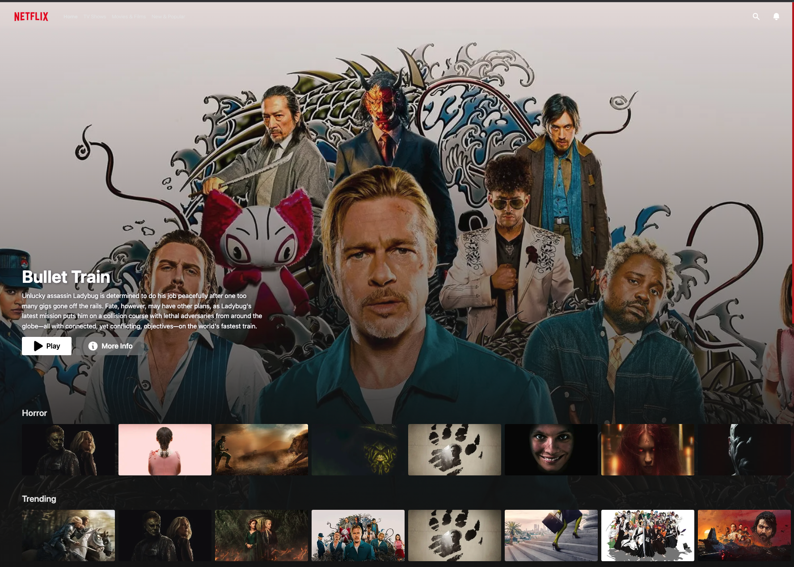

<h1 align="center">
  <br>
  <br>
Netflix Clone 🍿
  <br>
</h1>



<p align="center">
  <a href="#technology-used">Technology</a> |
  <a href="https://netflix-clone-mauve-three.vercel.app/">Live Demo</a> |
  <a href="#contact">Contact</a> |
</p>

# Technology

This project was made with the following open source packages:

- Next.js
- TypeScript
- TailwindCSS
- MaterialUI
- TMBD API
- Heroicons
- React-Icons
- React-Player
- Recoil

# How To Use

### With Git:

To clone and run this application, you'll need [Git](https://git-scm.com) and [Node.js](https://nodejs.org/en/download/) (which comes with [npm](http://npmjs.com)) installed on your computer. From your command line:

```bash
# Clone this repository
$ git clone https://github.com/trdotpy/netflix-clone

# Go into the repository
$ cd netflix-clone

# Install dependencies
$ npm install

# Run the app
$ npm run dev
```

# Contact

[Github](https://github.com/trdotpy/) |
[Email](mailto:tanvi.rahman@outlook.com)
